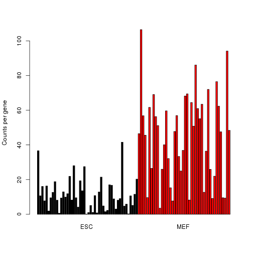
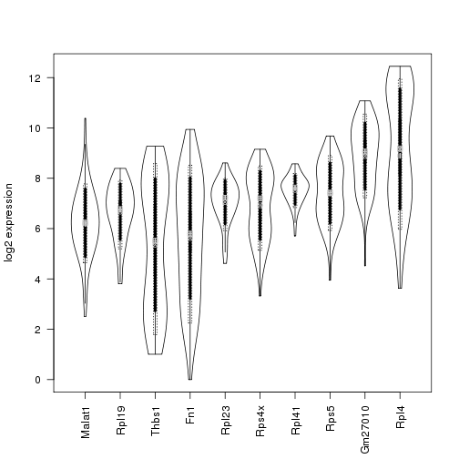
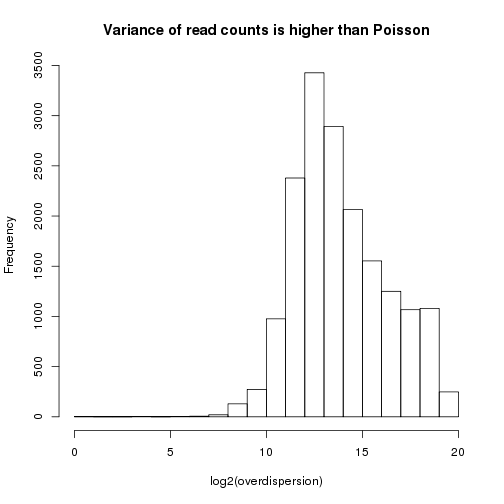
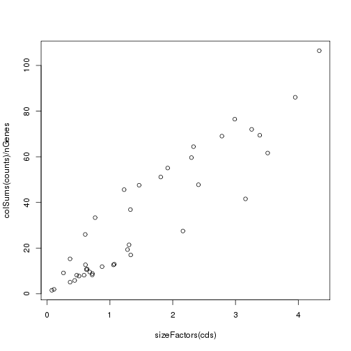
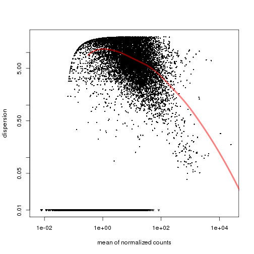
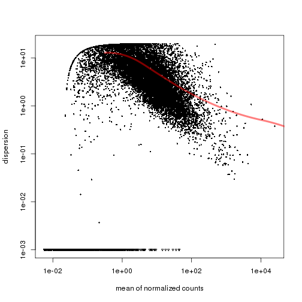
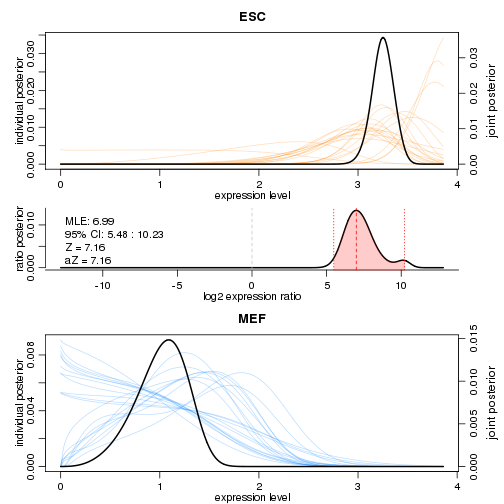
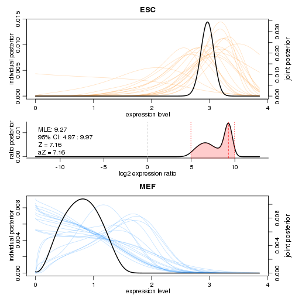

Running R on Orchestra
========================

In order to run R on Orchestra, we will first connect to an interactive queue, using 6 cores
```#bash
#jh361@mezzanine:~/$ bsub -n 6 -Is -q interactive bash
#Job <7846600> is submitted to queue <interactive>.
#<<Waiting for dispatch ...>>
#<<Starting on clarinet002-072.orchestra>>
```

Set up environment variables:
```#bash
#cd scw/scw2015
#source setup.sh
```

Run R
```#bash
#R
```

Loading count data
==================

We will load the counts for the ES/MEF mouse dataset of Islam *et al.*, which contains 48 embyronic stem (ES) cells, and 44 mouse embryonic fibroblast (MEF) cells. We will read in these counts from the table we generated earlier:

```r
load("ES_MEF_raw.RData")
# clean up column (cell) names
colnames(counts) <- gsub("L139_Sample(\\d+).counts","\\1",colnames(counts))
colnames(counts)[1:10]
```

```
##  [1] "MEF_54" "ESC_47" "MEF_61" "MEF_67" "ESC_19" "MEF_91" "MEF_62"
##  [8] "ESC_20" "ESC_13" "MEF_70"
```

The rows of the `counts` data frame represent genes, and the columns represent cells. However, the genes in our count file are named according to their Ensembl ID. In order to map these IDs to more informative gene names, we can use the R interface to BioMart. We will not run this procedure during this session, so as to avoid overloading the servers with multiple simultaneous requests, but this is how it might be done:

```r
library(biomaRt)
mart <- useMart(biomart = 'ensembl', dataset = 'mmusculus_gene_ensembl')
bm.query <- getBM(values=rownames(counts),attributes=c("ensembl_gene_id", "external_gene_name"),filters=c("ensembl_gene_id"),mart=mart)
genes <- list(ids=rownames(counts),names=bm.query[match(rownames(counts), bm.query$ensembl_gene_id),]$external_gene_name)
```

Gene identifiers
----------------
Due to time constraints we will simply read in the gene names from a table

```r
load("gene_name_map.RData")
```

The row names of the count table can then be set to these gene names:

```r
rownames(counts) <- make.unique(as.character(genes$names))
```

Cell identifiers
----------------
The identities of the different cells are known in this case, and we can obtain this information from the first three characters of the column labels:

```r
cell.labels <- substr(colnames(counts),0,3)
```

The dataset contains some cells that were used as negative controls, so we will remove these before further analysis:

```r
counts <- counts[-which(cell.labels=="EMP")]
cell.labels <- cell.labels[-which(cell.labels=="EMP")]
```

Reorder the cells so that the ES cells (columns) are all in the first half of the matrix:

```r
counts <- cbind(counts[,cell.labels=="ESC"],counts[,cell.labels=="MEF"])
cell.labels <- substr(colnames(counts),0,3)
```

Preliminary examination of the dataset
--------------------------------------

We can then examine some features of the dataset:

```r
length(counts[,1]) # number of genes
```

```
## [1] 39017
```

```r
length(cell.labels) # number of cells
```

```
## [1] 92
```

```r
nES <- sum(cell.labels=="ESC") # number of ES cells
nMEF <- sum(cell.labels=="MEF") # number of MEF cells
```

A factor object can be defined to index the different cell types. 

```r
groups <- factor(cell.labels,levels=c("ESC","MEF"))
table(groups)
```

```
## groups
## ESC MEF 
##  48  44
```

Before proceeding, we will restrict our attention to those genes that had non-zero expression:

```r
counts <- counts[rowSums(counts)>0,]
nGenes <- length(counts[,1])
```

Let's also save the full cleaned up count matrix for use in subsequent exersize:

```r
save(counts,file="counts.RData")
```

Let's examine the effective library size (estimated by the average read count per gene) for the different cells.

```r
coverage <- colSums(counts)/nGenes
ord <- order(groups)
bar.positions <- barplot(coverage[ord],col=groups[ord],xaxt='n',ylab="Counts per gene")
axis(side=1,at=c(bar.positions[nES/2],bar.positions[nES+nMEF/2]),labels=c("ESC","MEF"),tick=FALSE)
```

 

We can see that on average the expression is higher for the MEF cells. We'll filter out those cells with very low coverage

```r
counts <- counts[,coverage>1]
cell.labels <- cell.labels[coverage>1]
groups <- factor(cell.labels,levels=c("ESC","MEF"))
coverage <- coverage[coverage>1]
nCells <- length(cell.labels)
```

We can use a violin plot to visualize the distributions of the normalized counts for the most highly expressed genes. 

```r
counts.norm <- t(apply(counts,1,function(x) x/coverage)) # simple normalization method
top.genes <- tail(order(rowSums(counts.norm)),10)
expression <- log2(counts.norm[top.genes,]+1) # add a pseudocount of 1 
```

```r
library(caroline)
```

```r
violins(as.data.frame(t(expression)),connect=c(),deciles=FALSE,xlab="",ylab="log2 expression") 
```

```
## Loading required package: sm
## Package 'sm', version 2.2-5.4: type help(sm) for summary information
## Loading required package: MASS
## 
## Attaching package: 'MASS'
## 
## The following object is masked from 'package:sm':
## 
##     muscle
```

 

Some of these genes show a clear bimodal pattern of expression, indicating the presence of two subpopulations of cells. 


Negative binomial model for counts
==================================

Perhaps the simplest statistical model for count data is the Poisson, which has only one parameter. Under a Poisson model, the variance of the expression for a particular gene is equal to its mean expression. However, due to a variety of types of noise (both biological and technical), a better fit for read count data is usually obtained by using a *negative binomial* model, for which the variance can be written as:
$$\mbox{variance} = \mbox{mean} + \mbox{overdispersion} x \mbox{mean}^2$$
Since the overdispersion is a positive number, the variance under the negative binomial model is always higher than for the Poisson.

On our dataset, the overdispersion is clearly greater than zero for almost all genes, suggesting that the negative binomial will indeed be a better fit:

```r
means <- apply(counts.norm,1,mean)
excess.var <- apply(counts,1,var)-means
excess.var[excess.var < 0] <- NA
overdispersion <- excess.var / means^2
hist(log2(overdispersion),main="Variance of read counts is higher than Poisson")
```

 


Running DESeq
=============


```r
library(DESeq)
```

Several of the steps in the following analyses takes around 5 minutes to run on the full 92-cell dataset, using 6 cores on Orchestra. In order to save time for the purposes of this tutorial session, we will work with a subset of the data, sampling 20 cells from each of the groups:

```r
es.cell.subset <- which(groups=="ESC")[(1:20)*2]
mef.cell.subset <- which(groups=="MEF")[(1:20)*2]
cell.subset <- c(es.cell.subset,mef.cell.subset)
counts <- counts[,cell.subset]
cell.labels <- cell.labels[cell.subset]
groups <- factor(cell.labels,levels=c("ESC","MEF"))
nCells <- length(cell.labels)
```

First we will use our `count` and `groups` objects to create a DESeq `CountDataSet` object:

```r
cds <- newCountDataSet(counts, groups)
```

DESeq estimates *size factors* to measure the library size for each cell.

```r
cds <- estimateSizeFactors(cds)
```

Generally the estimated size factors are linearly related to the average read count per gene (coverage), but are estimated using a more robust method:

```r
plot(sizeFactors(cds),colSums(counts)/nGenes)
```

 

Estimating the overdispersion
-----------------------------

In order to compute $p$-values for differential expression, DESeq requires an estimate of the overdispersion for each gene. Since we have $40$ cells in total, we may wish to rely on the empirical estimates of the dispersion:

```r
cds <- estimateDispersions(cds, sharingMode="gene-est-only")
```

```
## Warning in .local(object, ...): in estimateDispersions: sharingMode=='gene-
## est-only' will cause inflated numbers of false positives unless you have
## many replicates.
```

In cases where the empirical estimates may not be so reliable (e.g. when there are very few cells), we can pool information from the other cells in each group in order to obtain a more robust estimator for the dispersion

```r
cds.pooled <- estimateDispersions(cds, method="per-condition",fitType="local")
# check the fit
plotDispEsts(cds.pooled,name="ESC") 
```

 

```r
plotDispEsts(cds.pooled,name="MEF") 
```

 

Differential expression analysis
--------------------------------

We are now ready to carry out the differential expression analysis. 

```r
de.test <- nbinomTest(cds, "ESC", "MEF")
```

We will also repeat the analysis using the pooled estimates for the dispersion parameters, to see what kind of difference this makes to the results:

```r
de.test.pooled <- nbinomTest(cds.pooled, "ESC", "MEF")
```

We can then extract the top differentially expressed genes, using a false discovery rate of $0.05$:

```r
find.significant.genes <- function(de.test.result,alpha=0.05) {
  # filter out significant genes based on FDR adjusted p-values
  filtered <- de.test.result[(de.test.result$padj < alpha) & !is.infinite(de.test.result$log2FoldChange) & !is.nan(de.test.result$log2FoldChange),]
  # order by p-value, and print out only the gene name, mean count, and log2 fold change
  sorted <- filtered[order(filtered$pval),c(1,2,6)]
}
de.genes <- find.significant.genes(de.test)
de.genes.pooled <- find.significant.genes(de.test.pooled)
```

This procedure pulls out a lot of genes as differentially expressed:

```r
length(de.genes[,1])
```

```
## [1] 2974
```

```r
length(de.genes.pooled[,1])
```

```
## [1] 778
```

Examining differentially expressed genes
----------------------------------------
We can examine the top $15$ of these

```r
head(de.genes.pooled,n=15)
```

```
##                   id    baseMean log2FoldChange
## 11228         Dppa5a   630.24357      -6.901726
## 11100           Rpl4 24974.59204      -3.094853
## 12725          Brca1    43.80824     -11.325013
## 13612         Gm2373    43.59149     -11.883117
## 11928  D930048N14Rik    35.79928     -11.465529
## 5668           Anxa3   346.09488       7.073363
## 1985            Prnp   330.81187       7.271655
## 10457            Tdh   169.22606      -8.306162
## 7112           Myadm   414.66382       6.417668
## 7775           Fanci    28.98334     -10.730172
## 15969         Pou5f1    73.01968      -7.278936
## 5056         Gm13242    48.38516      -7.926445
## 10507 RP23-103I12.13   271.73314       6.696415
## 6967           Ccnd2   677.09732       6.169517
## 13700            Fst   263.88969       5.866691
```

In this case, three genes show an obvious relationship to stem-cell differentiation:

Gene     Function                                                      
------   --------                                                      
Dppa5a   developmental pluripotency associated                         
Pou5f1   self-renewal of undifferentiated ES cells         
Tdh      mitochondrial; highly expressed in ES cells  

Running SCDE
============

An alternative approach to modeling the error noise in single cells and testing for differential expression is implemented by the [scde](http://pklab.med.harvard.edu/scde/index.html) package. 


```r
library(scde)
```

One of the major sources of technical noise in single-cell RNA seq data are *dropout* events, whereby genes with a non-zero expression are not detected in some cells due to failure to amplify the RNA. 

The package SCDE (Single-Cell Differential Expression) explicitly models this type of event, estimating the probability of a dropout event for each gene, in each cell. The probability of differential expression is then computed after accounting for dropouts.

First we will set the number of cores to the number we selected when opening up the interactive queue:

```r
n.cores <- 4 
```

We then fit the SCDE model to the data. Since we fit models separately for each cell in SCDE, we pass in unnormalized counts.

```r
scde.fitted.model <- scde.error.models(counts=counts,groups=groups,n.cores=n.cores,save.model.plots=F)
```
The fitting process relies on a subset of robust genes that are detected in multiple cross-cell comparisons. Since the `groups` argument is supplied, the error models for the two cell types are fit independently (using two different sets of robust genes). If the `groups` argument is omitted, the models will be fit using a common set.

We also need to define a prior distribution for the gene expression magnitude. We will use the default provided by SCDE

```r
scde.prior <- scde.expression.prior(models=scde.fitted.model,counts=counts)
```

Differential expression analysis
--------------------------------

Using the fitted model and prior, we can now compute $p$-values for differential expression for each gene

```r
ediff <- scde.expression.difference(scde.fitted.model,counts,scde.prior,groups=groups,n.cores=n.cores)
p.values <- 2*pnorm(abs(ediff$Z),lower.tail=F) # 2-tailed p-value
p.values.adj <- 2*pnorm(abs(ediff$cZ),lower.tail=F) # Adjusted to control for FDR
significant.genes <- which(p.values.adj<0.05)
length(significant.genes)
```

```
## [1] 2146
```
The adjusted $p$-values are rescaled in order to control for false discovery rate (FDR) rather than the proportion of false positives. This is one way of dealing with the issue of multiple hypothesis testing. As well as correcting for multiple testing, we can also instruct SCDE to correct for any known batch effects. Examples of this procedure can be found in the online tutorial for SCDE.

We can now extract fold differences for the differentially expressed genes, with lower and upper bounds, and FDR-adjusted p-values:

```r
ord <- order(p.values.adj[significant.genes]) # order by p-value
de <- cbind(ediff[significant.genes,1:3],p.values.adj[significant.genes])[ord,]
colnames(de) <- c("Lower bound","log2 fold change","Upper bound","p-value")
```

Examining differentially expressed genes
----------------------------------------

Examining the top $15$ most significant differentially expressed genes, there are now additional genes related to stem cell differentiation

```r
de[1:15,]
```

```
##        Lower bound log2 fold change Upper bound      p-value
## Thbs1    -4.360279        -3.494635   -2.628992 8.439044e-10
## S100a6   -4.520583        -3.687000   -2.821357 8.439044e-10
## Col1a2   -5.193862        -3.975548   -2.853418 8.439044e-10
## Cald1    -5.097679        -3.815244   -2.821357 8.439044e-10
## Efcc1     3.911427         5.546531    7.694610 8.439044e-10
## Gapdh     2.981661         3.911427    4.777070 8.439044e-10
## Apoe      4.392340         5.770957    7.470184 8.439044e-10
## Zfp42     4.232035         5.803018    9.361775 8.439044e-10
## Hmgb2     4.232035         5.578592    7.021331 8.439044e-10
## Tdh       5.578592         7.053392   10.002993 8.439044e-10
## Tpm1     -4.584705        -3.558757   -2.532809 8.439044e-10
## Dppa5a    5.642714         6.572479    7.406062 8.439044e-10
## Sparc    -4.520583        -3.494635   -2.596931 8.439044e-10
## Col1a1   -5.290044        -3.815244   -2.725174 8.439044e-10
## Timp2    -5.161801        -3.879366   -2.821357 8.439044e-10
```

Gene     Function                                                      
------   --------                                                      
Dppa5a   developmental pluripotency associated                         
Pou5f1   self-renewal of undifferentiated ES cells         
Tdh      mitochondrial; highly expressed in ES cells  
Zfp42    used as a marker for undifferentiated pluripotent stem cells  
Utf1     undifferentiated ES cell transcription factor          

Overlap between genes found by DESeq and SCDE
---------------------------------------------

We can also examine how many of the top $20$ genes found by both methods are the same:

```r
intersect(rownames(de)[1:20],de.genes[1:20,1])
```

```
## [1] "Cald1"  "Dppa5a"
```


```r
intersect(rownames(de)[1:20],de.genes.pooled[1:20,1])
```

```
## [1] "Tdh"    "Dppa5a" "Pou5f1" "Utf1"
```

For our example, estimating the dispersion using the pooled method in DESeq yields more genes in common with SCDE, and the four that are annotated all have some connection to stem-cell differentiation.

Expression differences for individual genes
-------------------------------------------

SCDE also provides facilities for more closely examining the expression differences for individual genes. Examining two of the genes shown above, we can see clear differences in the posterior distributions for expression magnitude.


```r
scde.test.gene.expression.difference("Tdh",models=scde.fitted.model,counts=counts,prior=scde.prior)
```

 

```
##           lb     mle       ub       ce        Z       cZ
## Tdh 5.482409 6.98927 10.22742 5.482409 7.160813 7.160813
```

```r
scde.test.gene.expression.difference("Pou5f1",models=scde.fitted.model,counts=counts,prior=scde.prior)
```

 

```
##              lb      mle       ub       ce        Z       cZ
## Pou5f1 4.969435 9.265592 9.970932 4.969435 7.160813 7.160813
```
On these plots, the coloured curves in the background show the distributions inferred for individual cells, and the dark curves denote overall distributions. By combining information from all the cells, the model is able to infer the overall distribution with high confidence.


